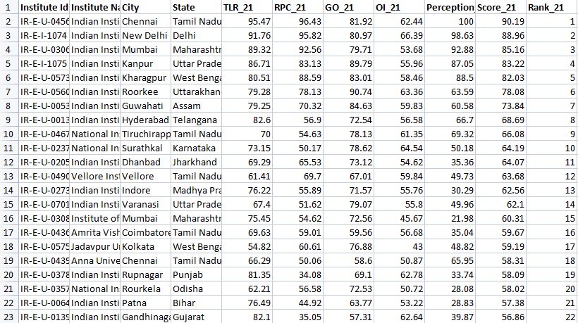
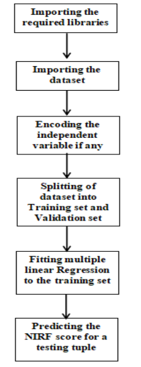
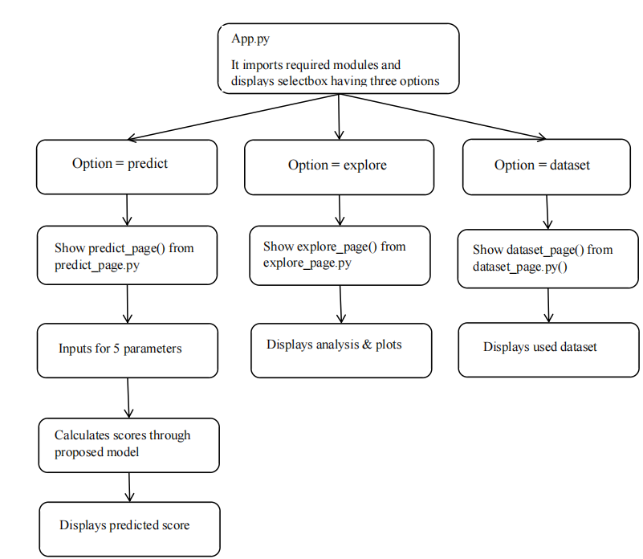

# NIRF-Score-prediction-and-analysis

An efficient web app for NIRF score prediction.
  
  
## Table of Content

* [About The Project](#1)
* [Literature survey](#2)
* [NIRF Dataset Description](#3)
* [Proposed approach and model](#4)
* [Result and Analysis](#5)
* [Future scope](#6)
* [Deployment](#7)
* [Reference](#8)

  
## About the Project 

  
India has  its higher educational institute ranking, called the NIRF ranking. It is an annual ranking scheme based on various parameters. So its necessary to have a check on this ranking system and have an analysis of ranks and scores given to universities and colleges.

Our objective is to develop an efficient web app for NIRF score prediction, firstly we need to know which algorithm is less prone to errors and is compatible for our system. In order to do so, we first studied different algorithms and then had a meaningful comparison among them. And once we know which one algorithm is the most suitable we go ahead to make our web app. Now after selecting the compatible algorithm, we will start building our model. 
Our web app predicting the NIRF scores will be using the multiple linear regression algorithm and front end isdeveloped by using streamlit library.

## Literature survey 

## NIRF Dataset Description 

The dataset is downloaded from the official website of National Institute Ranking Framework(20).
  
  
**The dataset contains five important factors and parameters on which NIRF ranking depends:**

1. Teaching, Learning & Resources (TLR)  
2. Research Productivity, Impact and IPR (RPII)  
3. Graduation Outcome (GO)        
4. Outreach and Inclusivity (OI) 
5. Perception (PR)  
  
  
**The columns of the actual dataset are :**
-  Institute Id
-  Institute Name
-  State
-  TLR_21
-  RPC_21
-  GO_21
-  OI_21
-  Perception_21
-  Score_21
-  Rank_21
  
And the dataset used in this model contains **200** rows.

## Proposed approach and model 

The steps of building the project involves :

1. **Data Acquisition** : This includes the collection of valid dataset.
2. **Data Cleaning** : This includes handling of missing values, erroneous data and noisy data.
3. **Building the applicable regressor models.**
4. **Analysis of the results of different models on the basis of predicted values for testing tuples.**
5. **Building the web app using the chosen model.**

- ### Methodology for Multiple Linear Regression Model -
   

 

  

- ### Methodology of WebApp -
   

 

  

## Result and Analysis 

## Future scope  

## Deployment 

## References 

